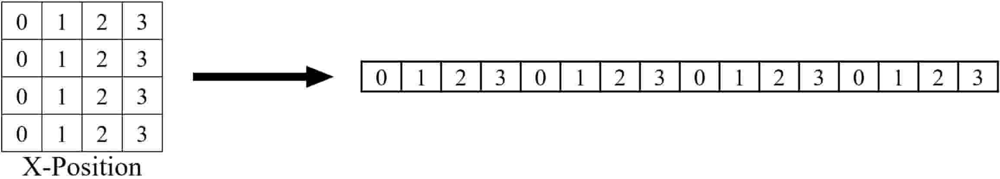
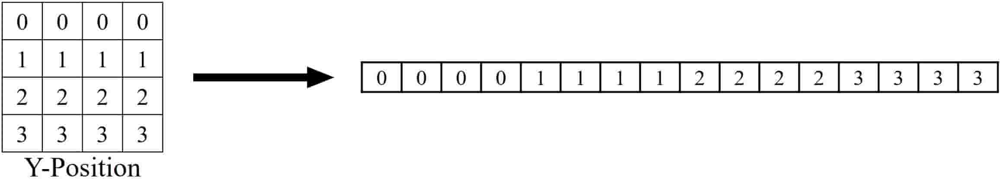
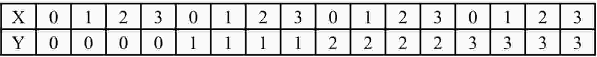

# 2D Positional Encodings for Vision Transformers (ViT)
<a href="https://colab.research.google.com/github/1kaiser/Media-Segment-Depth-MLP/blob/main/2D_Positional_Encoding_Vision_Transformer.ipynb" target="_parent"></a>
### Overview
This repository explores various 2D positional encoding strategies for Vision Transformers (ViTs), including:
- **No Position**
- **Learnable**
- **Sinusoidal (Absolute)**
- **Relative**
- **Rotary Position Embedding (RoPe)**

The encodings are tested on CIFAR10 and CIFAR100 datasets with a compact ViT architecture (800k parameters).  

### Key Features
- Implements 2D positional encodings by splitting dimensions into x and y sequences.
- Handles classification tokens uniquely for each encoding type.
- Provides a compact ViT model with only **800k parameters**.
- Comprehensive comparisons across CIFAR10 and CIFAR100 datasets (using a patch size of 4).

## Run commands (also available in <a href="scripts.sh">scripts.sh</a>) <br>
Use the following command to run the model with different positional encodings:
```bash
python main.py --dataset cifar10 --pos_embed [TYPE]
```

Replace ```TYPE``` with one of the following:
| Positional Encoding Type |  Argument                                |
|--------------------------|-------------------------------------------|
| No Position              | `--pos_embed none`                       |
| Learnable                | `--pos_embed learn`                      |
| Sinusoidal (Absolute)    | `--pos_embed sinusoidal`                 |
| Relative                 | `--pos_embed relative --max_relative_distance 2` |
| Rotary (RoPe)            | `--pos_embed rope`                       |

- Use the ```--dataset``` argument to switch between CIFAR10 and CIFAR100.
- For relative encoding, adjust the ```--max_relative_distance``` parameter as needed.

## Results
Test set accuracy when ViT is trained using different positional Encoding. 
<table>
  <tr>
    <th>Positional Encoding Type</th>
    <th>CIFAR10</th>
    <th>CIFAR100</th>
  </tr>
  <tr>
    <td>No Position</td>
    <td>79.63</td>
    <td>53.25</td>
  </tr>
  <tr>
    <td>Learnable</td>
    <td>86.52</td>
    <td>60.87</td>
  </tr>
  <tr>
    <td>Sinusoidal (Absolute)</td>
    <td>86.09</td>
    <td>59.73</td>
  </tr>
  <tr>
    <td>Relative</td>
    <td><strong>90.57</strong></td>
    <td><strong>65.11</strong></td>
  </tr>
  <tr>
    <td>Rotary (Rope) </td>
    <td>88.49</td>
    <td>62.88</td>
  </tr>
</table>
<br>

```ascii
=== CIFAR10 Test Accuracy Comparison ===

NONE            |████████████████████████▌                   | 49.23%
LEARN           |███████████████████████████                 | 54.14%
SINUSOIDAL      |███████████████████████████▍                | 54.76%
RELATIVE        |█████████████████████████▎                  | 50.53%
ROPE            |█████████████████████████████               | 57.93% ⭐
STRING_CAYLEY   |████████████████████████████▋               | 57.30%
STRING_CIRCULANT|███████████████████████████▉                | 55.73%

    0%    10%    20%    30%    40%    50%    60%    70%    80%


=== CIFAR100 Test Accuracy Comparison ===

NONE            |██████████▌                                 | 21.11%
LEARN           |████████████▏                               | 24.32%
SINUSOIDAL      |████████████▌                               | 25.05%
RELATIVE        |██████████▋                                 | 21.39%
ROPE            |████████████▊                               | 25.67%
STRING_CAYLEY   |█████████████                               | 25.96% ⭐
STRING_CIRCULANT|████████████▏                               | 24.30%

    0%    10%    20%    30%    40%    50%    60%    70%    80%


=== Summary Statistics ===

Method            CIFAR10    CIFAR100    Average
-------------------------------------------------
NONE              49.23%     21.11%      35.17%
LEARN             54.14%     24.32%      39.23%
SINUSOIDAL        54.76%     25.05%      39.91%
RELATIVE          50.53%     21.39%      35.96%
ROPE              57.93%     25.67%      41.80%
STRING_CAYLEY     57.30%     25.96%      41.63% ⭐ Best Overall
STRING_CIRCULANT  55.73%     24.30%      40.02%

📊 Key Findings:
- RoPE performs best on CIFAR10 (57.93%)
- STRING-Cayley performs best on CIFAR100 (25.96%)
- STRING-Cayley has the best average performance (41.63%)
- All position encoding methods outperform no encoding (NONE)
- STRING variants show competitive performance with established methods
```

```ascii
CIFAR10 Results (5 epochs):
NONE: 49.2% | LEARN: 54.1% | SINUSOIDAL: 54.8% | RELATIVE: 50.5%
ROPE: 57.9% ⭐ | STRING-CAYLEY: 57.3% | STRING-CIRCULANT: 55.7%

CIFAR100 Results (5 epochs):
NONE: 21.1% | LEARN: 24.3% | SINUSOIDAL: 25.1% | RELATIVE: 21.4%
ROPE: 25.7% | STRING-CAYLEY: 26.0% ⭐ | STRING-CIRCULANT: 24.3%
```


## Splitting X and Y Axes into 1D Positional Encodings
Instead of flattening image patches directly, we encode spatial information separately for the x and y axes:
- X-axis encoding applies 1D positional encoding to horizontal sequences.
- Y-axis encoding applies 1D positional encoding to vertical sequences.

Below is a visualization:  
- **X-axis Encoding**  
    
- **Y-axis Encoding**  
  
  
The x and y-axis sequences are replicated using [get_x_positions](https://github.com/s-chh/2D-Positional-Encoding-Vision-Transformer/blob/ea815c4481508d2439e2cdb4a49f770100515e4b/utils.py#L11) and [get_y_positions](https://github.com/s-chh/2D-Positional-Encoding-Vision-Transformer/blob/ea815c4481508d2439e2cdb4a49f770100515e4b/utils.py#L23) functions from the <a href="utils.py">utils.py</a> file.
The resulting encodings are combined to represent 2D spatial positioning.
<br>
<br>
</img>
<br>

## Handling the Classification Token
Positional encoding techniques handle classification tokens in unique ways:
- **No Position:** No encoding applied to classification tokens.
- **Learnable:** Classification token learns its encoding.
- **Sinusoidal:** Patch tokens receive sinusoidal encoding; classification token learns its own.
- **Relative:** The classification token is excluded from distance calculations. A fixed index (0) represents its distance in the lookup tables.
- **Rotary (RoPe):** X and Y positions start at 1 for patch tokens, reserving 0 for the classification token (no rotation applied).

## Parameter Comparison
The table below shows additional parameters introduced by different positional encodings:

| Encoding Type            | Parameter Description                             | Count   |
|--------------------------|--------------------------------------------------|---------|
| **No Position**          | N/A                                              | `0`     |
| **Learnable**            | `64 x 128`                                       | `8192`  |
| **Sinusoidal (Absolute)**| No learned parameters                            | `0`     |
| **Relative**             | Derived from max_relative_distance and other factors| `2304` |
| **Rotary (RoPe)**        | No learned parameters                            | `0`     |

## Base Transformer Configuration
Below are the training and architecture configurations:
- **Input Size:** 3 x 32 x 32
- **Patch Size:** 4  
- **Sequence Length:** 64  
- **Embedding Dimension:** 128  
- **Number of Layers:** 6  
- **Number of Attention Heads:** 4  
- **Total Parameters:** 820k  

Note: This repo is built upon the following GitHub repo: <a href="https://github.com/s-chh/PyTorch-Scratch-Vision-Transformer-ViT">Vision Transformers from Scratch in PyTorch</a>

### Citations
```
@article{vaswani2017attention,
  title={Attention is all you need},
  author={Vaswani, Ashish and Shazeer, Noam and Parmar, Niki and Uszkoreit, Jakob and Jones, Llion and Gomez, Aidan N and Kaiser, {\L}ukasz and Polosukhin, Illia},
  journal={Advances in neural information processing systems},
  volume={30},
  year={2017}
}
@inproceedings{dosovitskiy2020image,
  title={An Image is Worth 16x16 Words: Transformers for Image Recognition at Scale},
  author={Dosovitskiy, Alexey and Beyer, Lucas and Kolesnikov, Alexander and Weissenborn, Dirk and Zhai, Xiaohua and Unterthiner, Thomas and Dehghani, Mostafa and Minderer, Matthias and Heigold, Georg and Gelly, Sylvain and others},
  booktitle={International Conference on Learning Representations},
  year={2020}
}
@article{shaw2018self,
  title={Self-attention with relative position representations},
  author={Shaw, Peter and Uszkoreit, Jakob and Vaswani, Ashish},
  journal={arXiv preprint arXiv:1803.02155},
  year={2018}
}
@article{su2024roformer,
  title={Roformer: Enhanced transformer with rotary position embedding},
  author={Su, Jianlin and Ahmed, Murtadha and Lu, Yu and Pan, Shengfeng and Bo, Wen and Liu, Yunfeng},
  journal={Neurocomputing},
  volume={568},
  pages={127063},
  year={2024},
  publisher={Elsevier}
}
@article{schenck2025learning,
  title={Learning the RoPEs: Better 2D and 3D Position Encodings with STRING},
  author={Schenck, Connor and Reid, Isaac and Jacob, Mithun George and Bewley, Alex and Ainslie, Joshua and Rendleman, David and Jain, Deepali and Sharma, Mohit and Dubey, Avinava and Wahid, Ayzaan and others},
  journal={arXiv preprint arXiv:2502.02562},
  year={2025}
}
@misc{xiong2025ndrope
    author = {Jerry Xiong},
    title = {On N-dimensional rotary positional embeddings},
    year = {2025},
    url = {https://jerryxio.ng/posts/nd-rope/}
}
```
